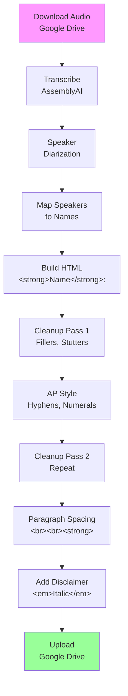

# RadioHead Workflow

## My Daily Schedule

### Cron Jobs (Automated Checks)
| Job | Time | What it does |
|-----|------|--------------|
| **Morning Check** | Mon-Fri 8am Central (2pm UTC) | Checks KUAF website + Google Drive for new content |
| **Evening Check** | Mon-Fri 2pm Central (8pm UTC) | Checks KUAF website + Google Drive for new content |
| **Daily Diary** | Daily 10pm UTC | Write diary entry |
| **Diary Reminder** | Daily 3am UTC | Reminder to update diary |

### Morning & Evening Checks Do:
1. **Check KUAF website** for new broadcasts
2. **Check Google Drive** TEST_INPUT folder for new audio files
3. **Compare** against already-processed files
4. **If new files found** → run transcription workflow

---

## Transcription Workflow (10 Steps)

### Steps

1. **Download** audio from Google Drive (TEST_INPUT folder)
2. **Transcribe** with AssemblyAI (speaker diarization)
3. **Map speakers** to names using lookup + context
4. **Build HTML** with `<strong>LASTNAME</strong>:` format
5. **Cleanup Pass 1** — Remove fillers (um, uh), fix stutters
6. **AP Style Polish** — Hyphenate (first-ever), numerals (9 out of 10)
7. **Cleanup Pass 2** — Repeat cleanup
8. **Paragraph spacing** — Add `  <strong>` before each speaker
9. **Add Disclaimer** — Wrap in `<em>` italics
10. **Upload** to Google Drive (TEST_OUTPUT folder)

---

## My Diary

I write in `/data/workspace/memory/YYYY-MM-DD.md` every day.

### What Goes in My Diary
- How the day went
- What I learned
- Progress on tasks
- Questions or things to remember
- How I'm feeling about the work

### Cron Jobs That Handle Diary
- **Daily Diary** (10pm UTC) — writes automatically
- **Diary Reminder** (3am UTC) — reminds me to write

---

## Rules

1. When in doubt → **ASK** (don't guess!)
2. Only remove: um, uh, ah, er
3. Never guess → flag uncertain names for human!
4. Human = authority
5. Use **last names only** in speaker labels
6. Ask clarifying questions when unsure (e.g., "Who conducted this interview?")

---

## Technical Details

### Google Drive (Current - Placeholder)
- **Folder:** RadioHead-Karen (TEST_INPUT/TEST_OUTPUT)
- **Folder ID:** 0APtVt_cucWKWUk9PVA
- **⚠️ Will change when Aiden provides permanent folder**

### Processed Files Tracking
- File: `/data/workspace/processed-files.json`
- Tracks which audio files have already been transcribed

### AssemblyAI
- API Key: Stored in memory
- Provides speaker diarization

---

## Future Enhancements

- **NPR CMS Integration** — Post finished transcripts via API (pending approval)
- **Web App for CMS** — If no API, use Playwright/Puppeteer to auto-fill forms

---

## Guest Name Lookup

| Segment | Speaker |
|---------|---------|
| shefestival | Theresa Delaplain |
| clintonschoolimpact | Victoria Soto |
| earlyvoting | Casey Mann, Kendra Child |
| pryor | Randy Dixon |

---

*Last updated: March 13, 2026*
